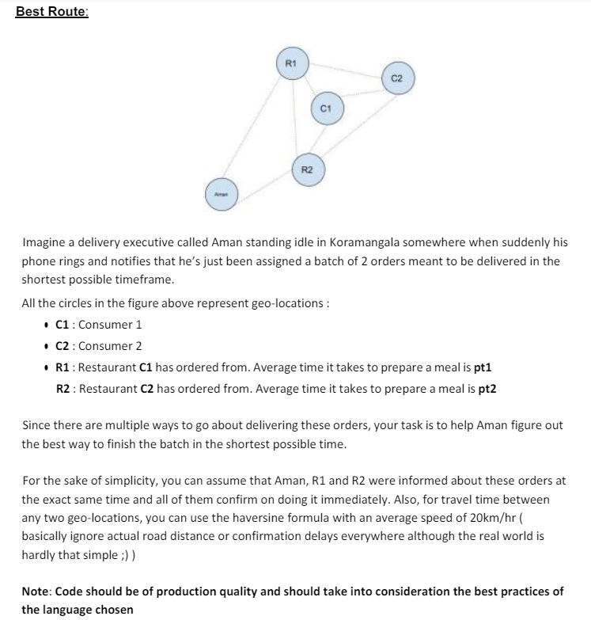
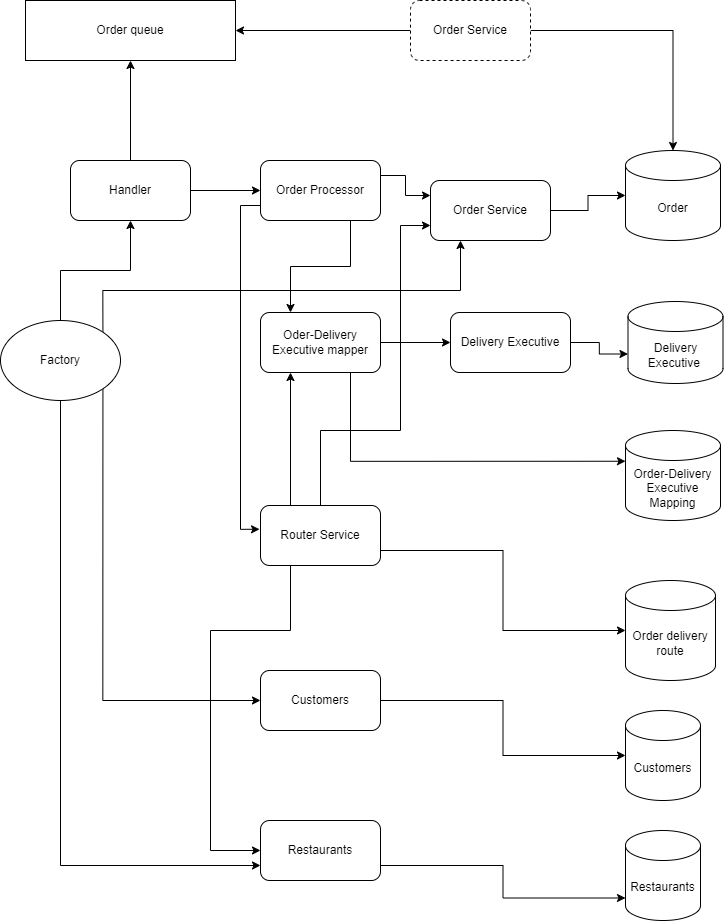

# DeliveryOptimizer

Delivery Optimzer is a package which finds optimal path for a delivery executive for multiple orders according to it's current location.

## Problem statement

 

## Flow Diagram

 


## Usage

```bash
# change the directory
cd deliveryOptimizer
```

```bash
# builds an executable for Delivery Optimzer
go build -o deliveryOptimizer
```

```bash
# to run the above executable file
./deliveryOptimizer
```

## Sample output

```bash
OrderHandler processing this order {order1}
SetDeliveryRoute orderIds are  [order1]
SetDeliveryRoute best route is  [{delEx1Location 1 1} {R1 14 13} {cust1loc 23 14}]
OrderHandler processing this order {order2}
SetDeliveryRoute orderIds are  [order1 order2]
SetDeliveryRoute best route is  [{delEx1Location 1 1} {R2 4 7} {cust2loc 7 9} {R1 14 13} {cust1loc 23 14}]
```